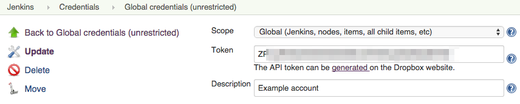
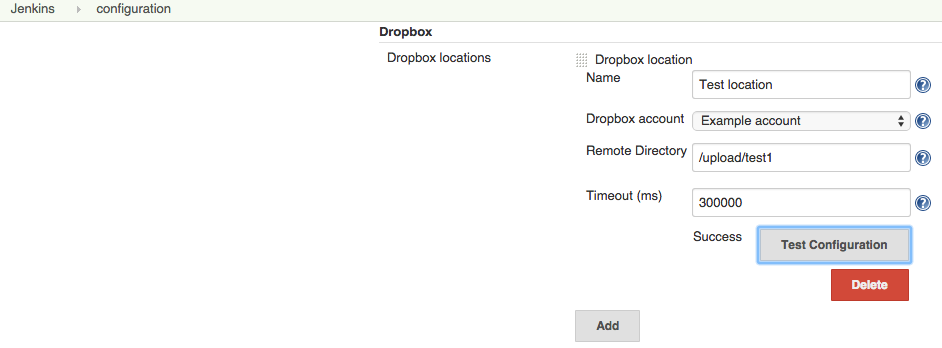
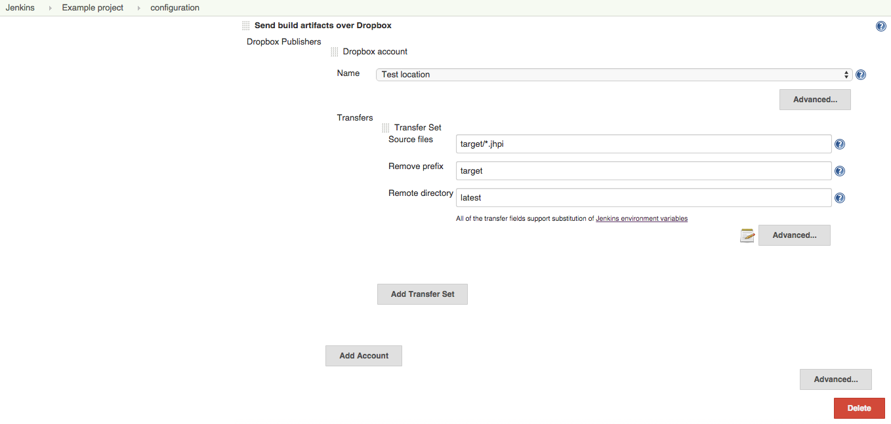

# Publish over Dropbox plugin for Jenkins

Based on publish-to-ftp and extending publish-to and basic-credentials this Jenkins plugin publishes artifacts in a post-build to dropbox folders without the need to run a sync client on your build server.

# Installation

There are 3 options:

1. ~~Install the plugin through the Jenkins plugin manager.~~ (Not available at this time)
2. Install a beta
   1. Download the latest build is available at:   https://github.com/rcgroot/jenkins-publish-over-dropbox-plugin/releases/tag/1.0-rc2
   2. Install the pre-build publish-over-dropbox-rc2.hpi in the advanced section of the Jenkins plugin manager on an existing Jenkins install.
3. Compile your own
  1. Create an own Dropbox app in the on https://developer.dropbox.com/
  2. Clone the sources and update the Config.java with your personal client id and client secret.
  3. Run the "mvn hpi:hpi" on the project source code
  4. Install the generated publish-over-dropbox.hpi on the advanced section of the plugin manager of your Jenkins installation.
# Configuration

To publish artifacts to a Dropbox there are three levels of configuration. Each level is dependent on the previous. 

### Link an account

The highest level is connecting a Dropbox account to Jenkins. Dropbox account connections can be created in the **Jenkins > Credentials**.

### Create a location

The second level is to create a location for a previously linked account. Locations can be created in **Jenkins > Manage Jenkins > Configure System**.

### Publish files

The last level is to actual publish files to a Dropbox location. Publishing can be done as **Post-build Actions** in your build job configuration.

# Credits

This project builds upon the [publish-over-plugin](https://github.com/jenkinsci/publish-over-plugin) by Anthony Robinson

Also this project builds upon the [credentials-plugin](https://github.com/jenkinsci/credentials-plugin) by CloudBees, Inc., Stephen Connolly

And much inspiration was found in the [publish-over-ftp-plugin](https://github.com/jenkinsci/publish-over-ftp-plugin) by Anthony Robinson

# Licence

The MIT License (MIT)

Copyright (c) 2015 René de Groot and other contributors.

Permission is hereby granted, free of charge, to any person obtaining a copy of this software and associated documentation files (the "Software"), to deal in the Software without restriction, including without limitation the rights to use, copy, modify, merge, publish, distribute, sublicense, and/or sell copies of the Software, and to permit persons to whom the Software is furnished to do so, subject to the following conditions:

The above copyright notice and this permission notice shall be included in all copies or substantial portions of the Software.

THE SOFTWARE IS PROVIDED "AS IS", WITHOUT WARRANTY OF ANY KIND, EXPRESS OR IMPLIED, INCLUDING BUT NOT LIMITED TO THE WARRANTIES OF MERCHANTABILITY, FITNESS FOR A PARTICULAR PURPOSE AND NONINFRINGEMENT. IN NO EVENT SHALL THE AUTHORS OR COPYRIGHT HOLDERS BE LIABLE FOR ANY CLAIM, DAMAGES OR OTHER LIABILITY, WHETHER IN AN ACTION OF CONTRACT, TORT OR OTHERWISE, ARISING FROM, OUT OF OR IN CONNECTION WITH THE SOFTWARE OR THE USE OR OTHER DEALINGS IN THE SOFTWARE.
